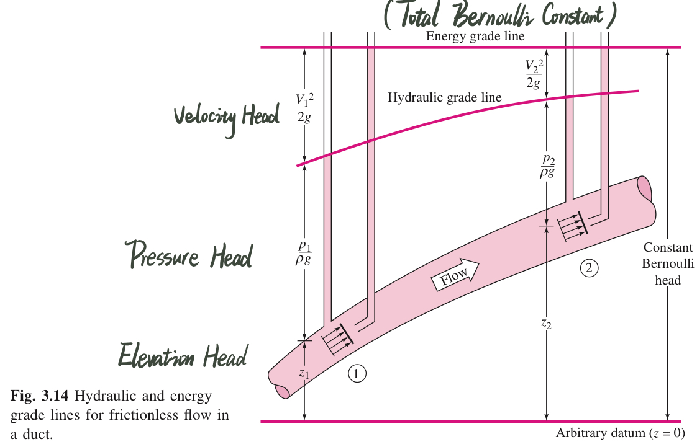

# Fluid Mechanics

## Viscosity (粘度)

- measure of a fluid's _resistance_ to flow, which determines the _fluid strain rate_ that's generated by the given shear stress.
- **Viscosity Coefficient $\mu$** are given by
  $$\tau = \mu \frac{du}{dy}$$
  which $u$ is moving speed of _upper surface_.
  - The _linear fluids_ that follow the equation above are called **newtonian fluid**.
  - The viscosity of newtonian fluid is a thermodynamic property and varies with _temperature_ and _pressure_. But generally, viscosity grows **weakly** with **pressure** but **strongly** with **temperature**.

## Kinematic Viscosity

- Definition:
  $$\nu = \frac{\mu}{\rho}$$

## Hydrostatic

### Hydrostatic Condition:

1.  Pressure in a static fluid varies only with **vertical distance**, and it's independent of the shape of the container.
2.  The pressure is _the same_ at all points on a given horizontal plane in the fluid.
3.  The pressure increase with _DEPTH_ in the fluid.

### Hydrostatic in Liquids:

- Liquids are nearly incompressible. Their density merely increase as going depth. Thus, we assume there's **constant density** in liquid hydrostatic calculations
  $$p_2 - p_1 = \rho g (z_1 - z_2)$$
  Or
  $$z_1 - z_2 = \frac{p_2}{\rho g} - \frac{p_1}{\rho g}$$

  The quantity $p / \rho g$ is a length called the _pressure head_ of the fluid.
  And we give an allies $\gamma$ with the value $\gamma = \rho g$ to simplify the expression.  
  

### Pascal's Law

Any two points at the same _elevation (height)_ in a _continuous mass_ of the same _static fluid_ will be at the _same pressure_.

### Hydrostatic Force on Plane Surface:

$$F = \int p \ dA = \int (p_{atm} + \rho gh) = p_a A + \rho g \int h \ dA$$

and we have relationship in geometry of $\int h dA = h_{centroid}A$, so we have:
$$F = (p_a + \rho gh_{centroid})A$$

- We can easily calculate the center of pressure after we introduce the concept of _Moment of Inertia($I$)_:
  $$y_{CP} = -\frac{I_{xx}\sin\theta}{h_{CG}A} \ \ \ \ x_{CP} = -\frac{I_{xy}\sin\theta}{h_{CG}A}$$

  Pay attention to the _sign convention!_ when we get an _negative \$y_{CP}$ or $x*{CP}\$*, meaning that the center of pressure should be _down below_ the geometry centroid.

    

- Example:
  > The gate in the figure below is $5ft$ wide, is hinged at point B, and rests again a smooth wall at point A. Find:
  > (a) the force on the gate due to seawater pressure,
  > (b) the horizontal force P exerted by the wall at point A,
  > <image src="./assets/plane-surface-example1.jpeg" width="50%" style="transform: translateX(50%);margin-bottom:20px"/>

Solution:

> (1) **Find the geometry centroid:** In this case, the centroid should be halfway between, that's $3ft$ height above point B. so $h_{CG} = 15ft - 3ft = 12ft$.
> (2) **Calculate the hydrostatic force:** $$F = p_aA + \gamma h_{CG} A = 64\times12\times(10\times5) = 38,400lbf$$
> (3) **Find the Center of Pressure**: First we have to calculate the moment of inertial for this rectangle gate

$$I_{xx} = \frac{bL^3}{12} \ \ \ \ I_{xy} = 0$$
Then we can calculate the distance between CP and CG:
$$l = - \frac{I_{xx}\sin\theta}{h_{CG}A} = -0.417ft \ \ \ (down \ below)$$

> By applying the equilibrium of moments, all the moments added together should equal to 0. ($\Sigma M = 0$):
> $$PL\sin\theta-F(5-l) = 0 \ \ \ \ \ \ \ P = 29,300lbf$$ > 

### Pressure Distribution in Rigid-Body Motion

- What is Rigid-body motion exactly?
  In rigid-body motion, all particles are in _combined translation and rotation_,there is **no relative motion** between particles.

- When a container filled with fluid move for a constant acceleration ($a = Constant$),
  we can find the inertial forces at each coordinates:
  $$f_x = 0 \ \ \ f_y = a\cos\alpha \ \ \ f_z = a\sin\alpha - g$$
  

  with equation ($dp = \rho \int (f_xdx + f_ydy + f_zdz)$), we get:
  $$ p = p_a + \rho[a y cos\alpha + z(a\sin\alpha - g)]$$

### Pressure Distribution in Rigid-Body Rotation

- We assume that the container has been rotating _long enough_ at **constant angular-velocity $\omega$**
- For any arbitrary position inside the container, by analyzing the inertial forces:
  $$ f_x = \omega^2 r \cos\alpha = \omega^2 x $$ $$ f_y = \omega^2 r \sin\alpha = \omega^2 y $$ $$ f_z = -g $$

 

also by bringing in the equation ($dp = \rho \int (f_xdx + f_ydy + f_zdz)$) we get:
$$p = \rho(\frac{\omega^2x^2}{2} + \frac{\omega^2y^2}{2} - gz) + C$$

and because $ x^2 +y^2 = r^2 $, we have $$p = \rho (\frac{\omega^2r^2}{2} - gz) + C$$

- If it's in the situation where $p = p_a$ at $(r,z) = (0,0)$,then $C = p_a$. The final desired distribution is:
- $$p = \rho (\frac{\omega^2r^2}{2} - gz) + p_a$$
- The pressure is linear in $z$ and parabolic in $r$. Let's say, $p = p_1$, the Equation is gonna become: $$z = \frac{p_a - p_1}{\rho g} + \frac{\omega^2r^2}{2g}$$ and we can compare it with normal form of parabolic polynomial: $$z = a + br^2$$

- For any point on the _free-surface_, pressure should always be identical to the atmosphere($p_{atm}$), so we get the equation of free-surface: $$z = \frac{\omega^2r^2}{2g}$$
  - when $r =  R$, height is at its maximum value ( $h_{max} = \frac{\omega^2R^2}{2g}$ )
  - the Volume of a paraboloid is _one-half the base area times its height_ that is $V = \frac{\pi R^2 h_{max}}{2}$
  - The center of the fluid _drops_ an amount of $h_{max}/2$ from the **still water level**, and edges rise an equal amount accordingly.

## Differential Relations for Fluid Flow

### Two ways to solve fluid flow problems --- eulerian frame and lagrangian frame

#### Eulerian Frame

- Total acceleration (**$a$**): $$a = \frac{∂u}{∂t} + (u\frac{∂V}{∂x} + v\frac{∂V}{∂y} + w\frac{∂V}{∂z})$$
  where $\frac{∂u}{∂t}$ is called _local acceleration_, which vanishes if the flow is _steady_ (independent of time, 定常流動), and the others are called _convective acceleration_.

### Streamline and Pathline

- Streamline: a line everywhere tangent(相切) to the velocity vector at a given instant.
  $$ \frac{dx}{u} = \frac{dy}{v} = \frac{dz}{w}$$

- Pathline: Actual path traversed by a given fluid particle.
  $$ x = \int u \ dt \ \ \ y = \int v \ dt  \ \ \ z = \int w \ dt$$ $$ dx = udt \ \ \ dy = vdt \ \ \ dz = wdt $$

### Volume Flow

- The total volume of fluid flowing through an Intersection with area of A per unit time, that is Volume Flow:
  $$q = \int_A v_ndA$$ $$q = v_{avg} A$$

### The Differential Equation of Mass Conservation (Continuity Relation)

$$\frac{∂\rho}{∂t} + \frac{∂(\rho u)}{∂x} + \frac{∂(\rho v)}{∂y} + \frac{∂(\rho w)}{∂z} = 0$$

- It requires no assumption except that the _density_ and _velocity_ are continuum functions.
- In terms of _incompressible flow_, the density changes are negligible. So we assume $∂p/∂t \approx 0$ _regardless of whether the flow is steady or not._ And the result: $$\frac{∂u}{∂x} + \frac{∂v}{∂y} + \frac{∂w}{∂z} = 0$$

### The Bernoulli Equation:

For **Steady, frictionless, incompressible** flow along a streamline:
$$\frac{p_1}{\rho} + \frac{V_1^2}{2} + gz_1 = \frac{p_2}{\rho} + \frac{V_2^2}{2} + gz_2 = Const$$

- A few terms on geometry:
  - Elevation Head (位置水頭) $z$
  - Pressure Head (壓力水頭) $p/\gamma = p/\rho g$
  - Velocity Head (速度水頭) $V^2/2g$
    

### Kinetic Energy Correction Factor

( $ \alpha $ )

Due to viscosity friction, flow energy is going to decline some how. Thus, we should do an correction for Bernoulli Equation if we want to apply it on actual flows. $$z_1 + \frac{p_1}{\rho g} + \frac{\alpha_1 \ V_1^2}{2g} = z_2 + \frac{p_2}{\rho g} + \frac{\alpha_2 \ V_2^2}{2g} + h_f $$

where $\alpha$ is equal to:$$\alpha = \frac{1}{A}\int (\frac{u}{v_{avg}})^3dA$$
All we need to remember : $\alpha$ is relative to ducts' intersection area.

## Viscous Flow in Ducts

### Two flowing state:

- Laminar (層流): Simply means "Steady".
- Turbulent (湍流): Fluctuating and Agitated.

### Reynolds Number

- Definition:
  $$Re = \frac{\rho \ VL}{\mu} = \frac{VL}{\nu}$$

### Critical Reynolds Number

Notice that when a transition from Laminar to Turbulent on a **normal commercial pipe**, the **critical Reynolds number** $Re_{crit}$ is at about $Re_{crit} \approx 2300$. When $Re > Re_{crit}$ , the flow is going to be Turbulent, otherwise it's going to be Laminar.

However, it's only meaningful for pipe, _other geometries_ have _completely different_ transition Reynolds number ($Re_d = Vd/\nu$) and critical Reynolds number.

<!-- ### Internal and External Viscous Flows: -->

### Laminar

#### Head Loss

- head lost along the pipe -- $h_\lambda$
  $$h_f = \lambda\frac{LV_{avg}^2}{2dg}$$
  where d is pipe's diameter, L is the length of pipe. And "$\lambda$" is called _Darcy friction factor (沿程阻力係數)_, which is affected by roughness of pipe.

  - $\lambda = \frac{64}{Re}$, is a **constant value** for any pipe, which is not related to any other factor.

- partial head lost -- $h_\zeta$
  - partial head lost $h_\zeta = \zeta \frac{v^2}{2g}$
  - partial pressure head lost $\Delta p = \zeta \frac{\rho v^2}{2}$
- total head lost -- $h_f$
  $$h_f = \Sigma h_\lambda + \Sigma h_\zeta$$
  which indicates the loss of _total energy_

  For incompressible steady flow inside an inclined (has different height in each part),constant-area pipe. We can apply _one-dimensional continuity relation_. That is: $$Q_1 = Q_2 = const, V_1 = V_2 = V$$. And we have <a href="#kinetic-energy-correction-factor">corrected Bernoulli Equation</a>:
  $$z_1 + \frac{p_1}{\rho g} + \frac{\alpha_1 \ V_1^2}{2g} = z_2 + \frac{p_2}{\rho g} + \frac{\alpha_2 \ V_2^2}{2g} + h_f $$
  $$h_f = \Delta z + \frac{\Delta p}{\rho g}$$

#### Laminar Fully Developed Pipe Flow

- Flow rate distribution across an arbitrary cross-section:
  $$u = \frac{\Delta p}{4L\mu}(R^2-r^2)$$
  where u have its maximum value when $r = 0$, and $u$ should be $$u_{max} = \frac{\Delta p}{4L\mu}R^2$$

- the Average flow rate for arbitrary cross-section:

  $$q = \int dq = \int ^R_0 u \ 2\pi r dr = \int ^R_0 \frac{\Delta p}{4L\mu}(R^2-r^2) \ 2\pi r dr = \frac{\pi R^4}{8\mu L}\Delta p$$
  $$v_{avg} = \frac{q}{A} = \frac{\Delta p}{8L\mu}R^2$$

  So, we can clearly know that for an arbitrary cross-section, the maximum flow rate is as **twice** as the average value, which appears in the **right middle** of the cross-section region.
