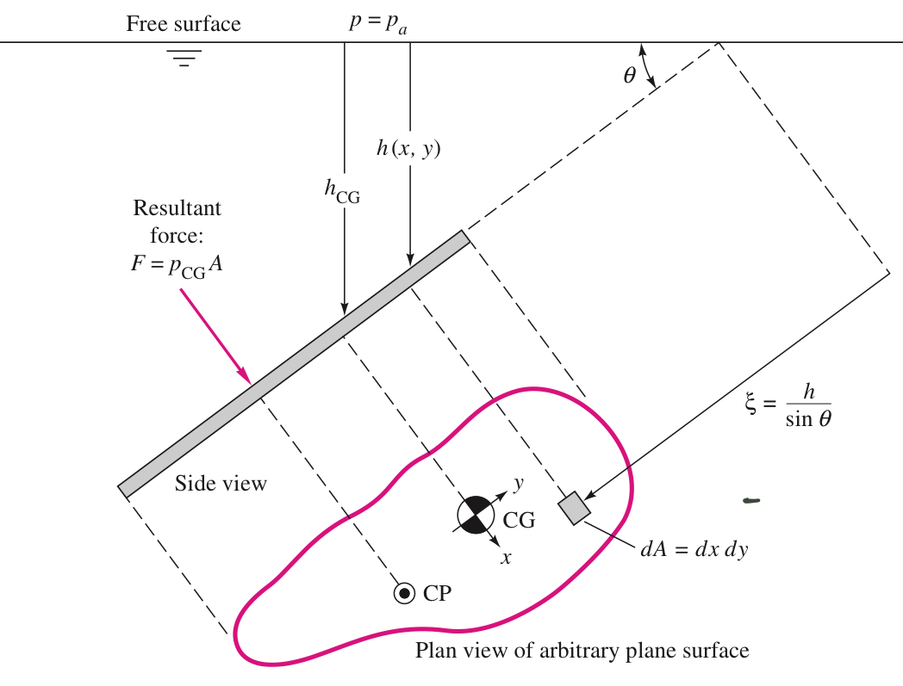

#  Fluid Mechanics
  
  
##  Viscosity (粘度)
  
  
- measure of a fluid's _resistance_ to flow, which determines the _fluid strain rate_ that's generated by the given shear stress.
- **Viscosity Coefficient ** are given by
  

  
  
  which  is moving speed of _upper surface_.
  - The _linear fluids_ that follow the equation above are called **newtonian fluid**.
  - The viscosity of newtonian fluid is a thermodynamic property and varies with _temperature_ and _pressure_. But generally, viscosity grows **weakly** with **pressure** but **strongly** with **temperature**.
  
##  Kinematic Viscosity
  
  
- Definition:
  

  
  
  
##  Hydrostatic
  
  
###  Hydrostatic Condition:
  
  
1.  Pressure in a static fluid varies only with **vertical distance**, and it's independent of the shape of the container.
2.  The pressure is _the same_ at all points on a given horizontal plane in the fluid.
3.  The pressure increase with _DEPTH_ in the fluid.
  

  
###  Hydrostatic in Liquids:
  
  
- Liquids are nearly incompressible. Their density merely increase as going depth. Thus, we assume there's **constant density** in liquid hydrostatic calculations
  

  
  
  Or
  

  
  
  
  The quantity  is a length called the _pressure head_ of the fluid.
  And we give an allies  with the value  to simplify the expression.  
  
  
###  Pascal's Law
  
  
Any two points at the same _elevation (height)_ in a _continuous mass_ of the same _static fluid_ will be at the _same pressure_.
  

  
###  Hydrostatic Force on Plane Surface:
  
  

  
  
  
and we have relationship in geometry of , so we have:

  
  

  
- We can easily calculate the center of pressure after we introduce the concept of _Moment of Inertia()_:
  

  
  
  
  Pay attention to the _sign convention!_ when we get an _negative \$y_{CP}x*{CP}\$*, meaning that the center of pressure should be _down below_ the geometry centroid.
  
    
  
- Example:
  > The gate in the figure below is  wide, is hinged at point B, and rests again a smooth wall at point A. Find:
  > (a) the force on the gate due to seawater pressure,
  > (b) the horizontal force P exerted by the wall at point A,
  > <image src="./assets/plane-surface-example1.jpeg" width="50%" style="transform: translateX(50%);margin-bottom:20px"/>
  
Solution:
  
> (1) **Find the geometry centroid:** In this case, the centroid should be halfway between, that's  height above point B. so .
> (2) **Calculate the hydrostatic force:** 

  
  
> (3) **Find the Center of Pressure**: First we have to calculate the moment of inertial for this rectangle gate
  

  
  
Then we can calculate the distance between CP and CG:

  
  
  
> By applying the equilibrium of moments, all the moments added together should equal to 0. ():
> 

  
 > 
  
###  Pressure Distribution in Rigid-Body Motion
  
  
- What is Rigid-body motion exactly?
  In rigid-body motion, all particles are in _combined translation and rotation_,there is **no relative motion** between particles.
  
- When a container filled with fluid move for a constant acceleration (),
  we can find the inertial forces at each coordinates:
  

  
  
  
  
  with equation (), we get:
  

  
  
  
###  Pressure Distribution in Rigid-Body Rotation
  
  
- We assume that the container has been rotating _long enough_ at **constant angular-velocity **
- For any arbitrary position inside the container, by analyzing the inertial forces:
  

  
 

  
 

  
  
  
 
  
also by bringing in the equation () we get:

  
  
  
and because , we have 

  
  
  
- If it's in the situation where  at ,then . The final desired distribution is:
- 

  
  
- The pressure is linear in  and parabolic in . Let's say, , the Equation is gonna become: 

  
 and we can compare it with normal form of parabolic polynomial: 

  
  
  
- For any point on the _free-surface_, pressure should always be identical to the atmosphere(), so we get the equation of free-surface: 

  
  
  - when , height is at its maximum value (  )
  - the Volume of a paraboloid is _one-half the base area times its height_ that is 
  - The center of the fluid _drops_ an amount of  from the **still water level**, and edges rise an equal amount accordingly.
  
##  Differential Relations for Fluid Flow
  
  
###  Two ways to solve fluid flow problems --- eulerian frame and lagrangian frame
  
  
####  Eulerian Frame
  
  
- Total acceleration (****): 

  
  
  where  is called _local acceleration_, which vanishes if the flow is _steady_ (independent of time, 定常流動), and the others are called _convective acceleration_.
  
###  Streamline and Pathline
  
  
- Streamline: a line everywhere tangent(相切) to the velocity vector at a given instant.
  

  
  
  
- Pathline: Actual path traversed by a given fluid particle.
  

  
 

  
  
  
###  Volume Flow
  
  
- The total volume of fluid flowing through an Intersection with area of A per unit time, that is Volume Flow:
  

  
 

  
  
  
###  The Differential Equation of Mass Conservation (Continuity Relation)
  
  

  
  
  
- It requires no assumption except that the _density_ and _velocity_ are continuum functions.
- In terms of _incompressible flow_, the density changes are negligible. So we assume  _regardless of whether the flow is steady or not._ And the result: 

  
  
  
###  The Bernoulli Equation:
  
  
For **Steady, frictionless, incompressible** flow along a streamline:

  
  
  
- A few terms on geometry:
  - Elevation Head (位置水頭) 
  - Pressure Head (壓力水頭) 
  - Velocity Head (速度水頭) 
    
  
###  Kinetic Energy Correction Factor
  
  
(  )
  
Due to viscosity friction, flow energy is going to decline some how. Thus, we should do an correction for Bernoulli Equation if we want to apply it on actual flows. 

  
  
  
where  is equal to:

  
  
All we need to remember :  is relative to ducts' intersection area.
  
##  Viscous Flow in Ducts
  
  
###  Two flowing state:
  
  
- Laminar (層流): Simply means "Steady".
- Turbulent (湍流): Fluctuating and Agitated.
  
###  Reynolds Number
  
  
- Definition:
  

  
  
  
###  Critical Reynolds Number
  
  
Notice that when a transition from Laminar to Turbulent on a **normal commercial pipe**, the **critical Reynolds number**  is at about . When  , the flow is going to be Turbulent, otherwise it's going to be Laminar.
  
However, it's only meaningful for pipe, _other geometries_ have _completely different_ transition Reynolds number () and critical Reynolds number.
  
  
  
  
###  Laminar
  
  
####  Head Loss
  
  
- head lost along the pipe -- 
  

  
  
  where d is pipe's diameter, L is the length of pipe. And "" is called _Darcy friction factor (沿程阻力係數)_, which is affected by roughness of pipe.
  
  - , is a **constant value** for any pipe, which is not related to any other factor.
  
- partial head lost -- 
  - partial head lost 
  - partial pressure head lost 
- total head lost -- 
  

  
  
  which indicates the loss of _total energy_
  
  For incompressible steady flow inside an inclined (has different height in each part),constant-area pipe. We can apply _one-dimensional continuity relation_. That is: 

  
. And we have <a href="#kinetic-energy-correction-factor">corrected Bernoulli Equation</a>:
  

  
  
  

  
  
  
####  Laminar Fully Developed Pipe Flow
  
  

  
- Flow rate distribution across an arbitrary cross-section:
  

  
  
  where u have its maximum value when , and  should be 

  
  
  
- the Average flow rate for arbitrary cross-section:
  
  

  
  
  

  
  
  
  So, we can clearly know that for an arbitrary cross-section, the maximum flow rate is as **twice** as the average value, which appears in the **right middle** of the cross-section region.
  