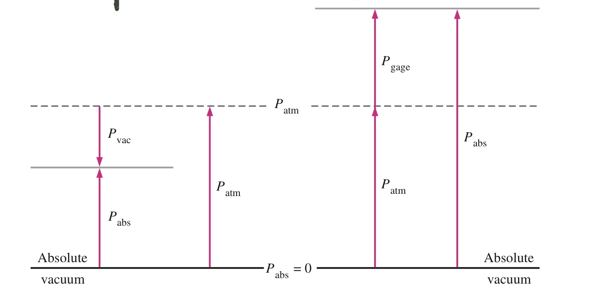
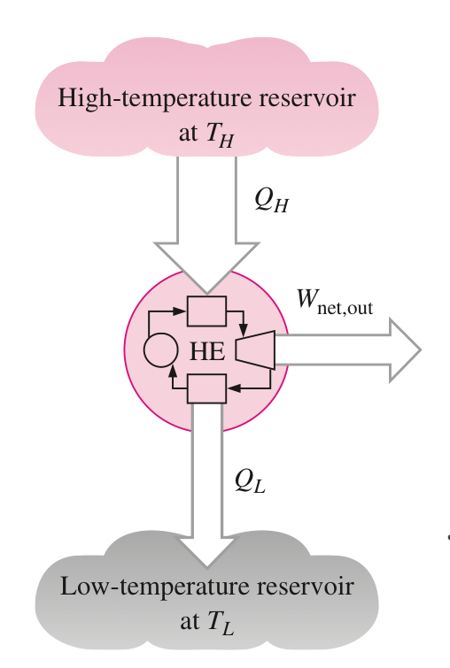
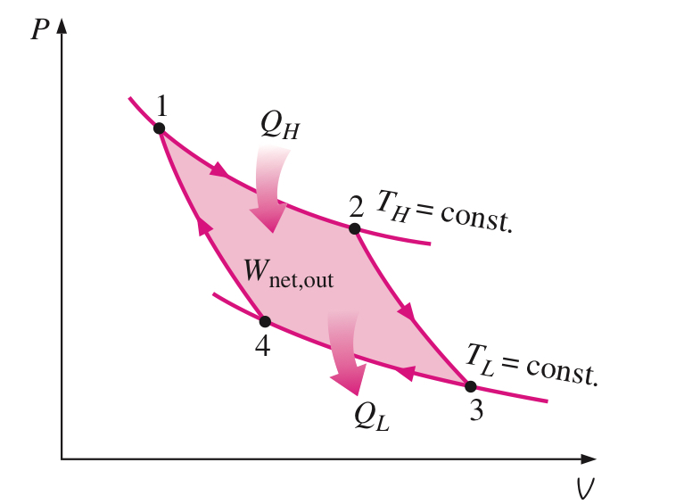
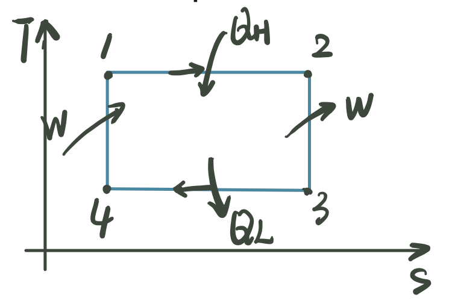
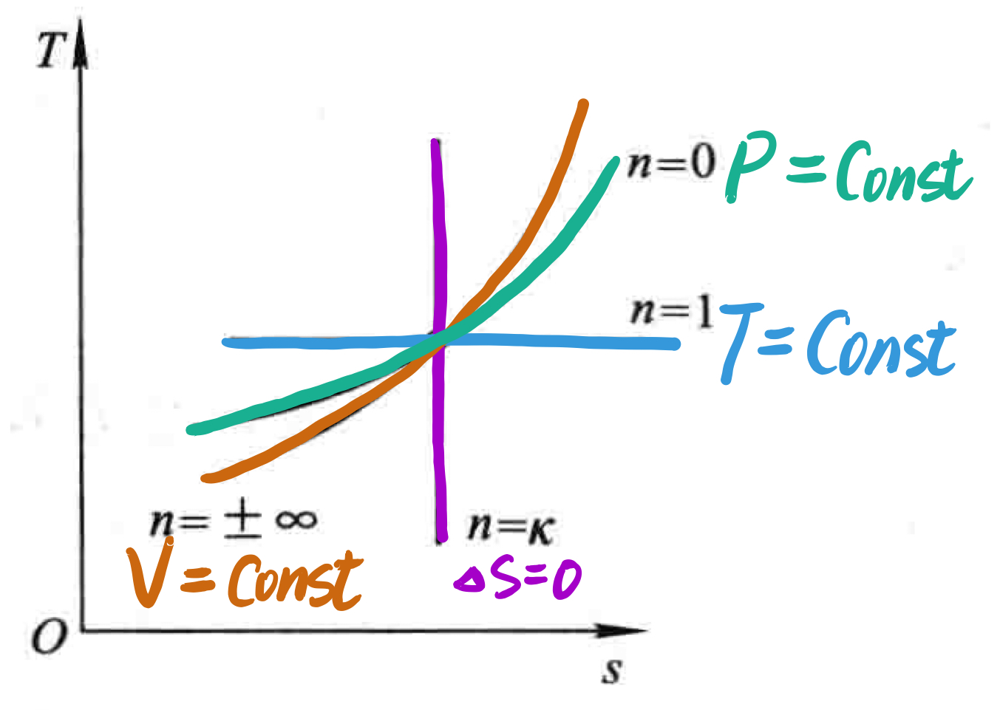
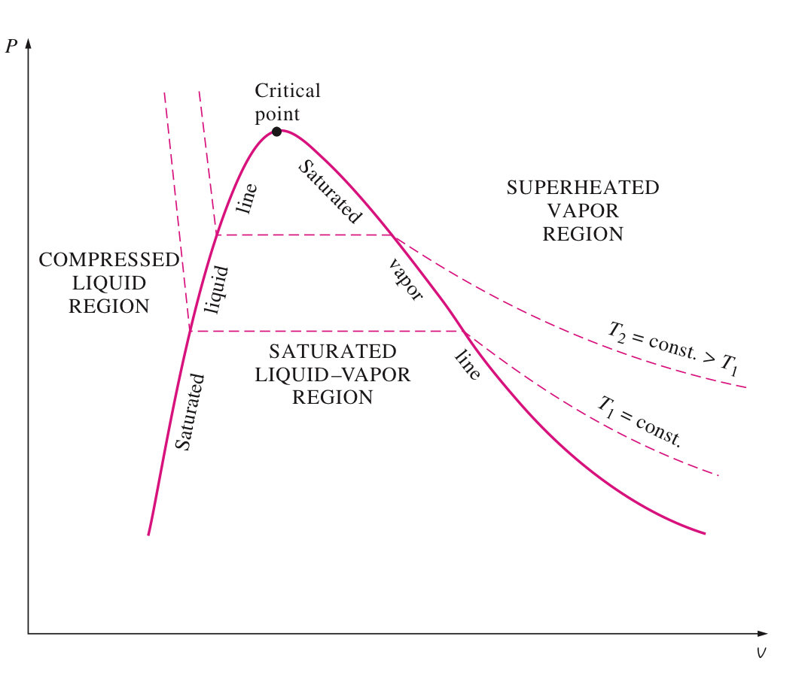

# Thermodynamics

## Chapter 1 Introduction

- **System**(系統): A quantity of matter or a region in space chosen for study.
- **Surroundings**(外界): Matter or Region outside the system
- **Boundary**(邊界): Real or Imaginary surface that separates System and Surrounding.

### Various Systems:

- **Closed System**:

  - _No mass_ can cross the boundary
  - _Fixed Mass_. So it's also known as **Control Mass System**
  - Energy exchange is allowed.

- **Open System**:

  - Mass can cross the boundary.
  - _Fixed Volume_, also known as **Control Volume System**
  - Energy exchange is allowed.

- **Isothermal System**:

  - _Heat Transfer_ is not allowed for Isothermal System.

- **Isolated System**:

  - Neither _Energy_ nor _Mass_ cannot cross the boundary.

### Property

- Characteristic of a system.

- Intensive Properties(強度參數): Properties that are _Independent_ of the _mass_ of the system.

  - **T**: Temperature
  - **P**: Pressure
  - **ρ**: Density

- Extensive Properties(廣延參數): Properties that are _depend on_ the _size/mass_ of the system.

### State(熱力狀態)

- Condition that represents or completely describe the entire system.
- Equilibrium State:
  - At the given state, all properties have _fixed_ values.
  - One of the property get changed, state will change to different one.
  - _No Unbalanced Potential_ OR _Driving Forces_ inside the system to break the balance.

### Density and Specific Volume

- **$ v = \frac{V}{m} = \frac{1}{\rho} $**
- By apply this, volume becomes an Intensive property! And we can apply similar technique for mass.

### Process

- A change that a system undergoes from one _equilibrium state_ to _another equilibrium state_

- Quasi-equilibrium(Quasi-static) Process:
  - Prefix "quasi-" means ready.
  - Assuming that we have a system which are going to operate for a certain long periods of time. And what's running under the hood goes really slow. The whole process can be treated as a combination of a serious of equilibrium states which are closed to each other.
  - _Idealized process_, can not be achieved.
- Process Diagrams:
  - Powerful for visualizing the process by plotting properties.
  - Process Path indicates a series of _quasi-equilibrium states_.
  - quasi-equilibrium => **Solid line**
  - nonquasi-equilibrium => **Dashed line**
  -

### Pressure

- Absolute pressure ($P_{abs}$) :

  - Indicates the _Actual pressure_ for the given position.
  - Measured relative to _Absolute Vacuum(0 Pa)_

- Gage Pressure ($P_{gage}$):

  - _Difference_ between _Absolute pressure_ ($P_{abs}$) and _Local Atmospheric pressure_ ($P{atm}$)
  - Directly read from gage.

- Vacuum Pressure ($P_{vac}$):

  - Pressures _below the Local Atmospheric pressure_ ($P_{atm}$)

- Relationship among the three:
  $$ P_{gage} = P_{abs} - P_{atm} $$ $$ P_{vac} = P_{atm} - P_{abs} $$
  

## Chapter 2 Energy and Energy Transform

- Total energy( $E$ ) and Specific energy ( $e$ ):
  $$e = \frac{E}{m}$$
  $e$ means Energy per unit mass basis.

### Forms of Energy

- Kinetic Energy (_KE_)
- Potential Energy (_PE_)
- **Internal Energy (Thermal Energy)** (_U_)

  - Internal Energy basically is the sum of all the _microscopic forms of energy_ for the system.
    $$ E = KE + PE + U = m\frac{V^2}{2} + mgz + U$$ $$ e = ke + pe + u = \frac{v^2}{2} + gz + u$$

- For a system, the total energy can be _contained / stored_ inside the system (**Static Forms**) or just _transferred_ into energy in another forms(**Dynamic Forms**) by interacting with others (**Energy Interaction**).

  - Particularly, for _closed system_, there's only **2 forms** of energy interactions to perform: **Heat Transfer** and **Work**
  - And for _open system_, besides **Heat Transfer** and **Work**, **Mass Transfer** also brings energy in from the outside world.

### Heat & Work

- **Heat** ( $Q$ ) : Energy being transferred between two system due to _temperature difference_.
- **Work** ( $W$ ): Energy transfer that internally associates with a _force_ acting through a certain _distance_
- **Sign Conventions**:

  - Heat Transfer:

    - _To_ a system: _POSITIVE +_
    - _From_ a system: _NEGATIVE -_

  - Work:
    - work done _By_ others : _POSITIVE +_
    - work done _To_ others : _NEGATIVE -_
      <image src="./assets/heat-work-sign-convention.jpeg" style="width:300px;" >

- Heat and Work are associated with _PROCESS_, not a _state_. Their magnitudes depend on the path for specific process as well as the end state.
-

### The First Law Of Thermodynamics

- It's all about Energy Conservation. Energy can only change its form, can be neither created nor destroyed.
- For _adiabatic process_, there's no heat transfer between systems. So the change in total energy must equal to the net work done.

### Energy Balance and Energy Change of a System

$$ E_{in} - E_{out} = \Delta E_{system} $$

### Energy Transform

- Energy can be transferred to or from a system in 3 forms: _heat_,_work_, _mass flow_.
  $$ \Delta U = (Q_{in} - Q_{out}) + (W_{in} - W_{out}) + (E_{mass,in} - E_{mass,out})  $$

|     | Ctrl Mass / Closed System | Ctrl Volume / Open System | Adiabatic System | Isolated System |
| --- | ------------------------- | ------------------------- | ---------------- | --------------- |
| W   | √                         | √                         | √                | X               |
| Q   | √                         | √                         | X                | X               |
| M   | X                         | √                         | √                | X               |

- In most-case scenario, we are probably going to come across Closed System, which means we can simplify our formula above:
  $$ \Delta U = \Delta Q - \Delta W  $$

  Notice that we put a minus sign in front of Work component, because _Work by(in)_ other system is set to be _negative_ and _work to(out)_ other system is _positive_.

## Chapter 3 Ideal-Gas Equation of State

### ( Specific ) Enthalpy ( $h$ )

- Combination of properties $ u + Pv$ (kJ/kg)

### Ideal-Gas Equation

$$Pv = RT$$
where $P$ is absolute pressure, $T$ is absolute temperature, $v$ is specific volume, and most importantly, $R$ is called **gas constant**.

And gas constant $R$ differs from each gas. So we have relationship like:
$$R=\frac{R_{universal}}{M}$$
where $R_{universal} = 8.31 KJ/kmol ・ K$ _(always a constant)_ and $M$ is molar mass.

By plotting $M = mN$, $V = \frac{1}{\rho} = mv$,we can easily get:

$$PV = mRT$$ $$PV = NR_{universe}T$$ $$\frac{P_1V_1}{T_1} = \frac{P_2V_2}{T_2}$$

### Moving Boundary work

$$\delta W_b = F \ ds = PA \ ds = P \ dV$$

- Notice that $dV$ is going to be _positive_ during an _expansion_ procedure, _negative_ during a _compression_ procedure.
  

Also, the integration of Process Path in the _P-v_ diagram is exactly the _boundary work_!
Thus, the Area beneath the path curve is the boundary work during the process.

As we can see, from **point 1** to **point 2**, gas gets expanded. $W < 0$. And on the contrary, from **point 2** to **point 1**, $W > 0$. So just pay attention to the direction about who this process gets performed.

### Net work circle

  

### Flow work (only meaningful for Open system)

$$W_{flow} = FL = PAL = PV$$$$w_{flow} = Pv$$
<image src="./assets/flow-work.jpeg" width="300">

### Total Energy for Flowing Fluid and Non-flowing Fluid

- Non-flowing fluid: $ e = u + \frac{V^2}{2} + gz = q - w_b + \frac{V^2}{2} + gz$
- Flowing fluid: $ e =pv + u +  \frac{V^2}{2} + gz = pv+ q - w_b + \frac{V^2}{2} + gz $

And previously we defined enthalpy $h = pv + u$, and we got relation when there's flowing fluid:
$$e = h +  \frac{V^2}{2} + gz$$

- Particularly, when we are dealing with **Steady-Flow Processes**, None of the properties (including _mass_, _volume_,_energy_) get changed in time. So we can apply _Energy Balance Relationship_ to this specific scenario. That is:$$E_{in} \equiv E_{out}$$
  When the fluid experiences **negligible changes** in its kinetic and potential energies, the energy balance equation can be simplified like this: $$ \Delta e = \Delta h  $$ $$ \Delta q - \Delta w  = \Delta h$$ which $\Delta q$ and $\Delta w$ is the _total heat transfer_ and _total work done_ dealing with the outside world. And $\Delta h$ is the _inner change_ of the system.

### Specific Heats

- energy required to raise the temperature of a _unit mass_ of substance by _one degree_
- Two kinds of specific heat:

  - _Specific Heat at constant volume $C_v$_
  - _Specific Heat at constant pressure $C_p$_

- Notice that $C_p$ is always **greater** than $C_v$, because it's going to take extra energy to remain constant pressure when gas gets expanded by rising the same degree.
  $$c_v = (\frac{∂u}{∂T})_v$$ $$c_p = (\frac{∂h}{∂T})_p = (\frac{∂(u+pv)}{∂T})_p$$

- For _ideal gases_ $C_v$ and $C_p$ are related by $$C_p = C_v + R$$ where R is the gas constant which has value varying from different gases.
  And we have _specific heat ratio_ $k$ is defined as $$ k = \frac{C_p}{C_v} \gt 1 $$ which is **always greater than 1**.

### Enthalpy Changes Related to specific heat

- the differential form of enthalpy changes can be: $$dh = du + vdP + Pdv$$
  When dealing with _incompressible substances_, $\Delta u \simeq c_{avg} \Delta T$. So $dv$ is gonna be $0$. And we have $dh = du + vdP$
  When we have situation where _P is a Constant_ and we have $dh = du + Pdv$.
  Similarity,When _T is a Constant_, we have $dh = vdP$.

## Chapter 4 The Second Law of Thermodynamics

### Heat Engines

- Characteristics:
  1.  They receive heat from a _High Temperature Source_.
  2.  They convert part of this _heat_ to _work_.
  3.  They _reject_ the _remaining energy_ to the low-temperature source.
  4.  They operate on **A Cycle**.
      

### Thermal Efficiency of a heat engine

**Thermal efficiency = Net work output / Total heat input**
Or$$\eta_{th} = \frac{W_{net,out}}{Q_{in}}$$
Which indicates how efficiently a heat engine converts the hear that it receives to work.
Since we have $W_{net,out} = Q_{in} - Q_{out}$, and It can also be expressed as: $$\eta _{th} = 1 - \frac{Q_{out}}{Q_{in}}$$

To relate this equation with temperature, we define:
$Q_H$ : Heat transfer between the _high-temperature medium_ and _cyclic device_
$Q_L$ : Heat transfer between the _Low-temperature medium_ and _cyclic device_

So we can plot them in:
$$\eta _{th} = 1 - \frac{Q_{Low}}{Q_{High}}$$

### Coefficient of Performance (COP):

$$ COP = \frac{Desired \ Output}{Required \ input} $$

### Two statements of The Second Law of Thermodynamics:

- Kelvin-Planck Statement:

_"It's impossible for any device that operates on a cycle to receive heat from **a single reservoir** and produce **a net(equal) amount of work**."_

which can also be expressed as:_"There's no heat engine that has a thermal efficiency of 100%_"

- Clausius Statement:
  _"It's impossible to construct a device that operates in a cycle and produces **no effect** other than transfer of heat from a lower-temperature body to a higher-temperature body."_

### Reversible and Irreversible Process

Reversible Process: Process that can be reversed _without leaving any trace_ on the surroundings. Both the _system_ and its _surroundings_ are returned to their **initial states** at the end of the process.

Reversible processes are merely _idealized situation_.

Reversible is a combined process which is neither _internal reversible_ nor _external reversible_. Also it's known as _total reversible_.

Reversible Process provides upper limits on the performance of real cycles.

### Carnot Cycle and Carnot Heat Engine

#### Carnot Cycle

The Carnot cycle is composed of four reversible processes -- **two isothermal** and **two adiabatic** process.

1. Reversible Isothermal Expansion ($T_H =$ const, $Q_H$ is provided )
2. Reversible Adiabatic Expansion ($\Delta Q = 0$, $T_H$ starts to drop till it reaches $T_L$ )
3. Reversible Isothermal Compression ($T_L =$ const, $Q_L$ is emitted )
4. Reversible Adiabatic Expansion ($\Delta Q = 0$, $T_L$ starts to grow till it reaches $T_H$ )

  
  

#### Carnot Heat Engine

Basically, Carnot heat engine is an **adiabatic** piston-cylinder device which operates on a reversible Carnot cycle.

The efficiency of carnot heat engine also known as **Carnot efficiency** are given by:

$$ \eta_{th,reversible} = 1 - \frac{T_L}{T_H} $$

which is **always less than 1**

And this is the _highest efficiency_ a heat engine can have between the two thermal energy reservoirs at the given temperature $T_L$ and $T_H$.

Thus, for any heat engine whose efficiency reaches _Carnot efficiency_ is definitely _reversible heat engine_. For those who cannot reach _Carnot efficiency_ are known as _irreversible heat engine_.

## Chapter 5 Entropy

### Definition:

$$dS = (\frac{\delta Q}{T})_{internal,reversible}$$

- Entropy is a **Property**, so entropy change ($\Delta S$) between two specific _states_ are exactly the **same** no matter the path.
  But Pay attention to here : It's only independent to the path that's an **Internal Reversible Path**. In other words, the integral of $\delta Q / T$ along an _irreversible path_ is not a property.

Entropy of a fixed mass can be changed by **Heat Transfer** or **Irreversibilities**.

  
  
### Special Case: Internal Reversible Isothermal Heat Transfer Process

In this special scenario, temperature is gonna be a constant( $T = T_0$ ). And we have $$\Delta S = \frac{Q}{T_0}$$

### The Increase of Entropy Principle

Consider a cycle is made up of two processes:

1. Arbitrary Process (Reversible OR Irreversible);
2. Internal Reversible Process.
   
   So we can easily get:
   $$\int^2_1 \frac{\delta Q}{T} + \int^1_2 (\frac{\Delta Q}{T})_{int,rev} ≤ 0$$ $$\int^2_1 \frac{\delta Q}{T} - \Delta S ≤ 0$$

The equation above will equals 0 when both process are reversible process.
And for any process that's not reversible, we finally get:
$$dS ≥ \frac{\delta Q}{T}$$ $$S_{sys} = S_2 - S_1 = \int_1^2 \frac{\delta Q}{T} + S_{generated}$$

And $S_{gen}$ should always be **positive or zero**:

- Reversible Process: $S_{gen} = 0$
- Irreversible Process: $S_{gen} ≥ 0$

expression of $\int_1^2 \frac{\delta Q}{T}$ represents external heat transfer to the system.
So, for _isolated system_ or _adiabatic closed system_, $S_{sys} = S_{gen} ≥ 0$

### Isentropic Process

- Process where Entropy remains a constant ($\Delta S = 0$)
- **Reversible Adiabatic Processes** are Isentropic.
- An isentropic process doesn't have to be a Reversible Adiabatic Processes.

### The _T ds_ Relations

$$\delta Q - \delta W = dU$$ $$\delta Q = TdS$$ $$\delta W = PdV$$
Thus, $$TdS = dU + PdV $$ $$Tds = du + Pdv \ \ \ \ \ (1)$$
And If we apply $h = u +Pv$ -> $dh = du + Pdv + vdP$ ,we get: $$Tds = dh - vdP\ \ \ \ \ (2)$$
From equations (1) and (2), we get:

$$ds = \frac{du}{T} + \frac{Pdv}{T}$$ $$ds = \frac{dh}{T} - \frac{vdP}{T}$$

For _ideal gases_, we've defined the concept of <a href="#specific-heats">Specific Heat</a> $c$ and <a href="#ideal-gas-equation">Ideal Gas Equation</a>.
So we have:
$$ds = c_v \frac{dT}{T} + R\frac{dv}{v} \ \ \ \ s_2 - s_1 = \int^2_1 c_v(T)\frac{dT}{T} + R\ln \frac{v_2}{v_1} $$
$$ds = c_p \frac{dT}{T} - R\frac{dP}{P} \ \ \ \ s_2 - s_1 = \int^2_1 c_p(T)\frac{dT}{T} - R\ln \frac{P_2}{P_1} $$

For most of the cases, we can just replace $C_v(T) \ C_P(T)$ with $C_{v,avg} \ C_{P,avg}$ to simplify our equations.

### Isentropic Processes of Ideal Gases

- At this case, $\Delta S = 0$, and the equations below should be:
  $$\ln \frac{T_2}{T_1} = \ln (\frac{v_1}{v_2})^{R/c_v} = \ln (\frac{v_1}{v_2})^{k-1} $$ since $R/c_v = k - 1 \ \ \ k = c_p/c_v$
- and we have: $$Tv^{k-1}=constant$$ $$TP^{\frac{1-k}{k}}=constant$$ $$PV^k = constant$$

### Specific Scenarios:

We can put all of this in a form:
| | Constant-Volume | Constant-Pressure | Isothermal | Polytrophic | Isentropic |
|---------------- | --------------- | --------------- |---------------- | --------------- | -- |
| $n$ | $\plusmn \infin $ | 0 | $1$ | $n$ | $k$ |
| Characteristic | $dV \equiv 0$ | $P \equiv P_0$ | $T \equiv T_0$ | \ | $dS = 0$ |
| P V T relation| $\frac{P1}{P2} = \frac{T1}{T2}$ | $\frac{V1}{V2} = \frac{T1}{T2}$ | $PV = C$ | $PV^n = C$ | $PV^k = C$ |
| Boundary work $$w_b =  \int Pdv$$ | 0 | $$P_0(V_2 - V_1)$$ | $P_1V_1 ln\frac{V_2}{V_1}$ |$$\frac{P_2V_2 - P_1V_1}{1-n}$$ $$C\frac{V^{-n+1}_2 - V^{-n+1}_1}{-n+1}$$ $$\frac{mR(T_2 - T_1)}{1 - n}$$ | $c_v (T_1 - T_2)$ |
|Heat Transfer $Q$| $c_v\Delta T$ | $$c_P\Delta T$$ $$u_2+p_0v_2 - (u_1 - p_0v_1) = h_2 -h_1$$| $P_1V_1 ln\frac{V_2}{V_1}$ | \ | 0 |
| Thermal Energy $$U = Q - W $$ | $c_v\Delta T$ | | 0 | \ |$$c_v (T_2 - T_1)$$ |

- For Air, $k = 1.4$

## Chapter X Vapor

### Five states about Vapor (at constant pressure):

- State 1: Water exists in _Liquid Phase_ ($T = 20\degree C \ P = 1atm$)
- State 2: **Saturated liquid** which is ready to vaporize ($T = 100\degree C \ P = 1atm$)
- State 3: **Saturated liquid-vapor mixture**, part of the saturation liquid vaporized ($T = 100\degree C \ P = 1atm$)
- State 4: **Saturated Vapor**, All the liquid has completely vaporized. ($T = 100\degree C \ P = 1atm$)
- State 5: **Superheated Vapor**($T \gt 100\degree C \ P = 1atm$)

### Latent heat of vaporization

- Definition: The amount of energy _absorbed_ or _release_ during vaporization is called Latent Heat of vaporization.
- The latent head only depends on the _pressure_ that the vaporization process occurs.

### Diagrams

## Gas Power Cycle

### Ideal Cycle

- Idealization and simplification:
  - 1.  The cycle doesn't involve any _friction_.
  - 2.  All expansion and compression processes take place in a _quasi-equilibrium_ manner
